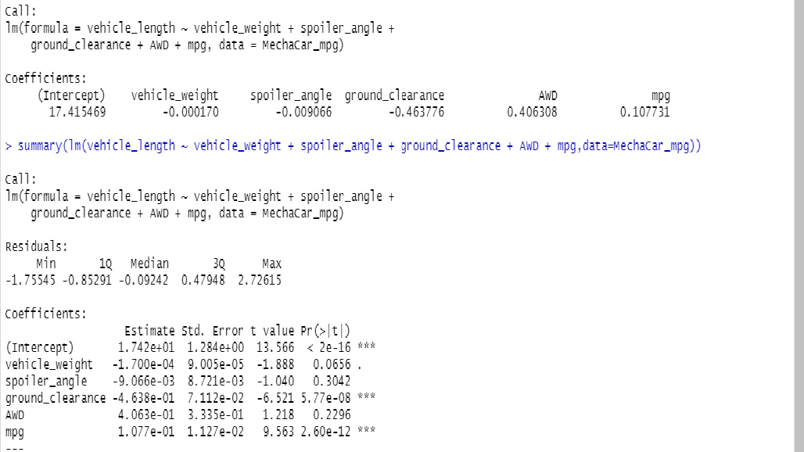

# MechaCar_Statistical_Analysis
Module 15

## Summary Statistics on Suspension Coils

-  Deliverable 1: Linear Regression to Predict MPG

-  In the summary output, each Pr(>|t|) value represents the probability that each coefficient contributes a random amount of variance to the linear model. According to our results, ground clearance and mpg (as well as intercept) are statistically unlikely to provide random amounts of variance to the linear model. When an intercept is statistically significant, it means there are other variables and factors that contribute to the variation in quarter-mile time that have not been included in our model. These variables may or may not be within our dataset and may still need to be collected or observed.

From our linear regression model, the r-squared value is 0.68, which means that roughly 68% of all predictions will be correct when using this linear model. 

-  Deliverable 2: Create Visualizations for the Trip Analysis
